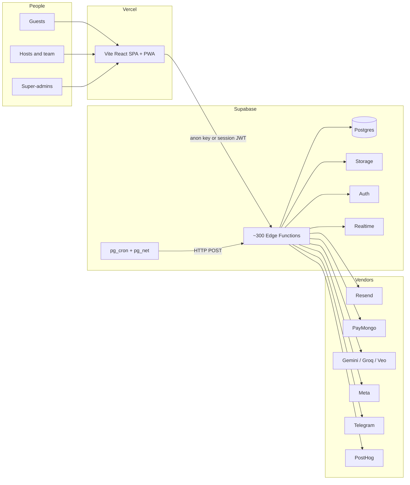
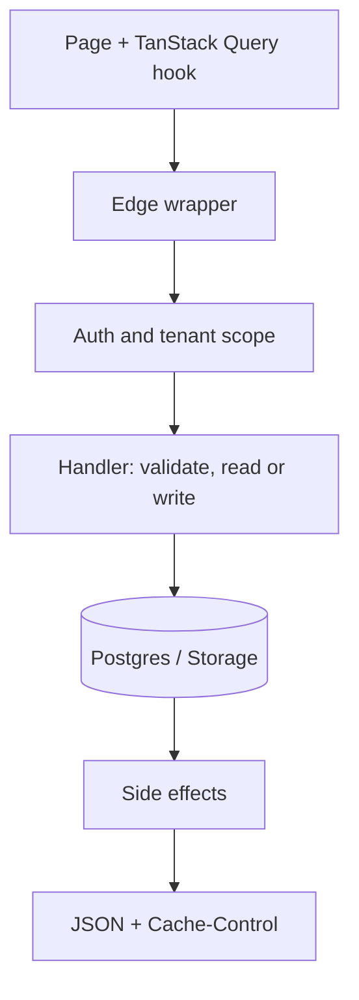
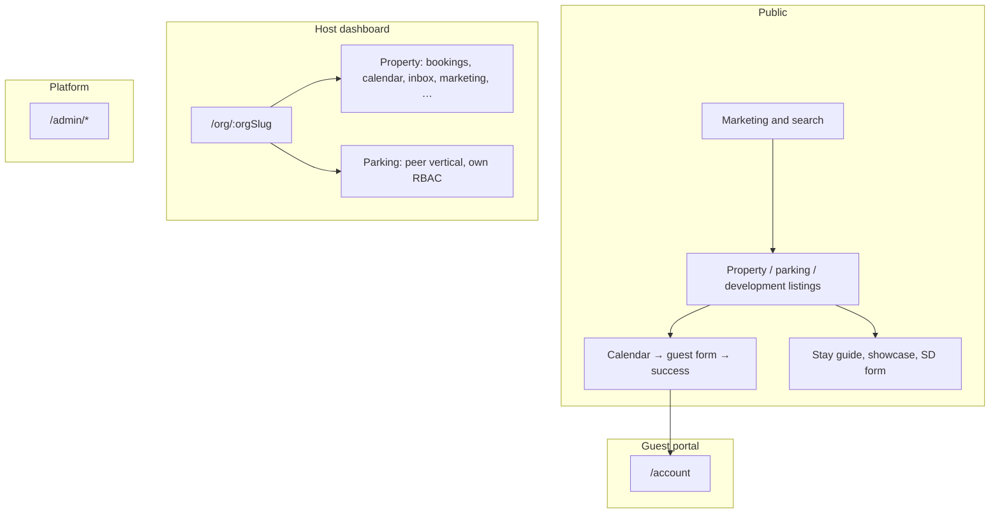
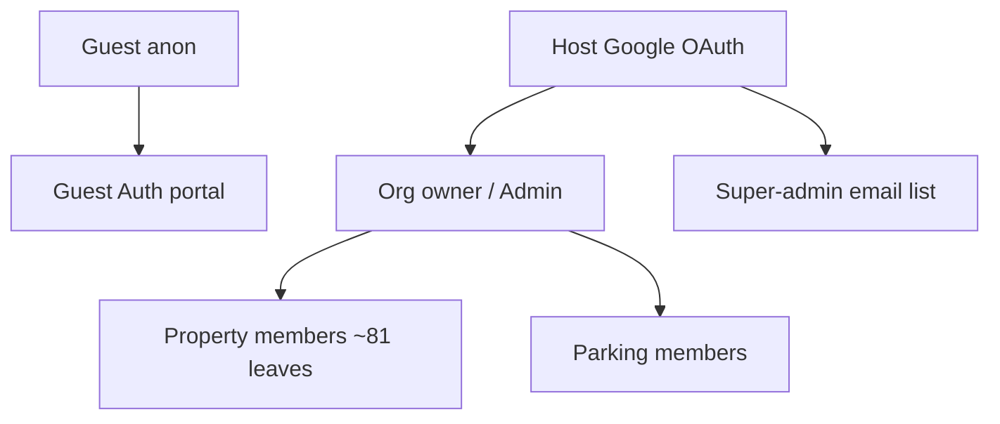
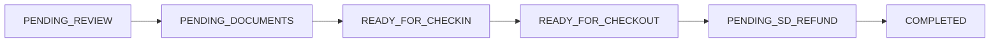
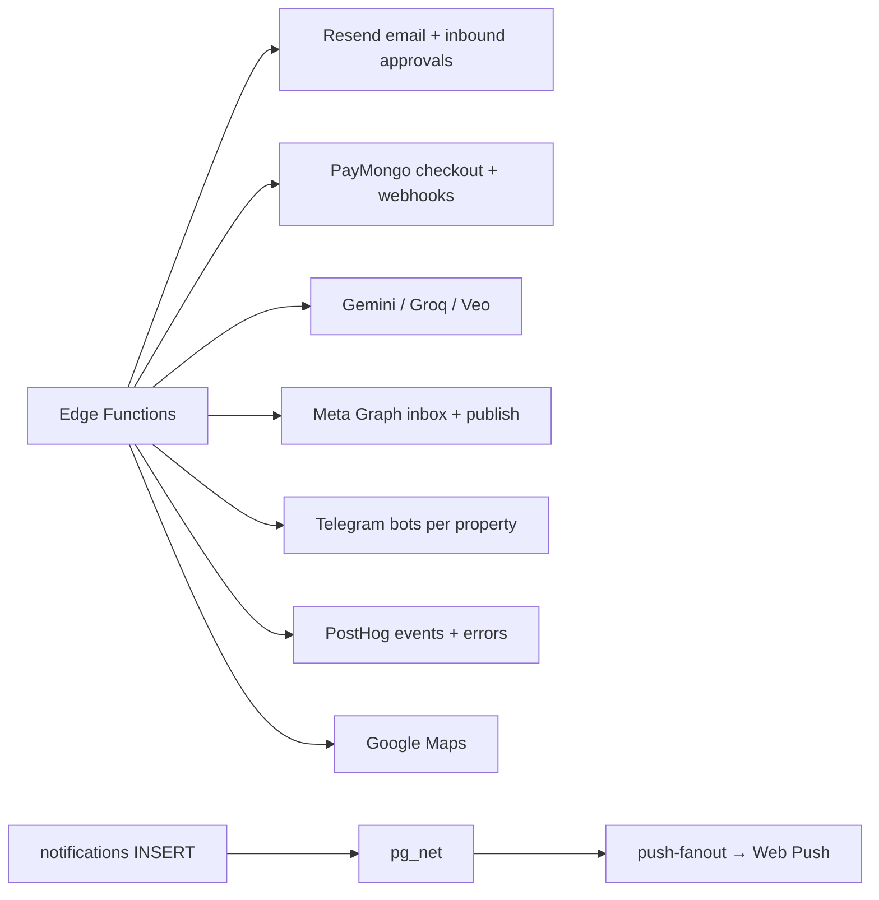

# Architecture overview

**Start here** for a picture of the whole Kame Homes app. Topic files under [`docs/architecture/`](./) hold depth. Index: [`docs/PROJECT.md`](../PROJECT.md).

Kame Homes is a **multi-tenant short-term rental platform**: public listings and guest booking, a host dashboard (property **and** parking as peer verticals), org billing, and a super-admin console. The original product was a Guest Advice Form (GAF) for one unit. That loop still sits at the center. The app around it is much larger.

---

## Contents

1. [The whole system](#1-the-whole-system)
2. [Who uses it](#2-who-uses-it)
3. [Tech stack](#3-tech-stack)
4. [What happens on a request](#4-what-happens-on-a-request)
5. [Product surfaces](#5-product-surfaces)
6. [Identity and access](#6-identity-and-access)
7. [Data and files](#7-data-and-files)
8. [Booking workflow](#8-booking-workflow)
9. [Integrations and jobs](#9-integrations-and-jobs)
10. [Deploy tracks](#10-deploy-tracks)
11. [Repository layout](#11-repository-layout)
12. [Local development](#12-local-development)
13. [Topic index](#13-topic-index)
14. [Known notes](#14-known-notes)
15. [Key files](#15-key-files)

---

## 1. The whole system

Browsers load a **Vite SPA** from **Vercel**. The SPA calls **Supabase Edge Functions** (Deno). Functions talk to **Postgres, Storage, and Auth** over PostgREST HTTP (not a direct Postgres socket). Scheduled work is **`pg_cron` + `pg_net`** posting back into those functions. Vendors (email, payments, AI, Meta, Telegram) are called from the edge, not from the browser.

There is **no separate Node API package**. Access control lives in the edge wrappers and scope helpers. RLS is extra protection for some client reads, not the main gate.

---

## 2. Who uses it

| Persona           | What they see                                                                     | How they prove who they are                                           |
| ----------------- | --------------------------------------------------------------------------------- | --------------------------------------------------------------------- |
| Guest (anon)      | Marketing, listings, calendar, booking form, stay guide, SD form, parking request | Anon key. Some pages use a capability token (`?token=`, `?complete=`) |
| Guest (signed in) | `/account`: trips, chat, profile, tickets, vouchers                               | Supabase Auth, separate from host identity                            |
| Host / team       | `/org/:orgSlug/property/:slug/…` and `/org/:orgSlug/parking/:slug/…`              | Google OAuth + org / property / parking membership                    |
| Super-admin       | `/admin/*`                                                                        | `SUPER_ADMIN_EMAILS`. Writes need a step-up OTP                       |

Routes: [`routing.md`](routing.md). Per-page behavior: [`docs/guides/routes/`](../guides/routes/README.md).

---

## 3. Tech stack

| Layer           | What we use                                                                                                     |
| --------------- | --------------------------------------------------------------------------------------------------------------- |
| Package manager | **Bun** (`bun install`, `bun run …`)                                                                            |
| UI              | **Vite 4.4**, **React 19** (`ui/package.json`), **TypeScript**, **React Router 6**                              |
| UI libraries    | Tailwind 3, Radix / shadcn, React Hook Form + Zod, TanStack Query 5, TanStack Virtual, Sonner, Lucide, Recharts |
| PWA             | `vite-plugin-pwa` injectManifest, Workbox, IndexedDB persist + outbox, Web Push. See [`pwa.md`](pwa.md)         |
| API             | **Supabase Edge Functions** (Deno). Wrappers in `_shared/serveEdge.ts`                                          |
| Data            | **Postgres** (SQL in `supabase/migrations/`, no ORM), **Storage**, **Auth**, **Realtime**                       |
| Jobs            | Hosted **`pg_cron`** fires `pg_net.http_post` into cron functions. Not `config.toml` schedule                   |
| Tests           | Vitest (UI), Deno (`_shared` + handlers), Playwright mocked E2E (`@smoke` / `@ci` / `@live`)                    |

Specialized UI: **Polotno** + **Remotion** (Marketing Studio), **Google Maps**, Web Worker image compression, pdf-lib. Phone chrome uses shared primitives (`ResponsiveModal`, `BottomTabBar`, `ContextualActionBar`), not a shrunk desktop layout.

**Timezone:** all user-visible times are **Asia/Manila**. Guest date fields in Postgres are often `TEXT` `MM-DD-YYYY`; UI and query params prefer `YYYY-MM-DD`. Normalize with `ui/src/utils/format/dates.ts` and `_shared/utils.ts`.

---

## 4. What happens on a request

1. **Client.** React Router page. Query hook. Forms: Zod + RHF. Images go through `prepareUpload` before the body is built.
2. **Wrapper.** `servePublic` / `serveAuthenticated` / `serveAdmin` / `serveSuperAdmin` / `serveCronPost`. CORS, `x-request-id`, structured logs, default `private, no-store`.
3. **Scope.** `verifyAdminJwt`, `verifyOrgAccess`, `verifyPropertyAccess`, `resolveScopedParkingAccess`. Plan keys and RBAC leaves are checked here, not only in the UI.
4. **Write + effects.** Service-role client. Then `WorkflowOrchestrator` (bookings), `logActivity`, notifications, PostHog. Effects run after a successful write, never in a `catch`.

Public listing GETs may use `publicStatic` / `publicDynamic` / `publicAvailability` cache classes. Admin and guest-PII responses stay `no-store`. Contracts: [`edge-functions.md`](edge-functions.md).

---

## 5. Product surfaces

**Guest feature folders** (`ui/src/features/guest/`): marketing, search, property, calendar, form, sd-form, pay-parking, stay-guide, account, auth, chat, booking-documents.

**Dashboard feature folders** (`ui/src/features/dashboard/`): org, property, parking, bookings, finance, maintenance, pricing, inbox, marketing, analytics, page-editor, custom-pages, team, plans, activity, ai-assistant, help-support, import, announcements, notifications, setup-guide, super-admin, offline.

Entry: `ui/src/main.tsx` → `App.tsx` → `ui/src/routes/index.tsx` merges `guestRoutes` + `dashboardRoutes`.

| Capability            | What it is                                            | Gate                              |
| --------------------- | ----------------------------------------------------- | --------------------------------- |
| Booking workflow      | GAF / pet / parking docs, emails, SD refund, vouchers | `bookings:*` leaves               |
| Calendar sync         | Two-way iCal (Airbnb / Booking.com / Vrbo)            | `calendarSync` (Pro+)             |
| Smart pricing         | AI nightly rates + autopilot cron                     | `smartPricing`                    |
| Guest Inbox           | Meta + web chat, AI replies                           | inbox leaves                      |
| Marketing Studio      | Polotno, Remotion, Gemini/Veo generate, Meta publish  | `marketingStudio` + generate keys |
| Finance / Maintenance | Line items, recurrence, Telegram reminders            | matching leaves                   |
| Parking marketplace   | Broadcast, claim, PayMongo, endorsement               | parking RBAC                      |
| AI assistant          | Dashboard chat + tools, credit wallet                 | org credits + allowlist           |
| Host Analytics        | Occupancy / ADR bundle, AI review                     | `analyticsInsights`               |
| PWA                   | Install, offline read, inbox outbox, Web Push         | deepest on host dashboard         |

**Billing is org-level only** (`org_subscriptions`). A property left out of enrollment resolves to Free. Plans UI: `/org/:orgSlug/plans`. Matrix: [`plans-feature-matrix.md`](plans-feature-matrix.md).

---

## 6. Identity and access

Do not mix these tiers. Guest Auth is **not** host admin.

| Tier                          | Server gate                                                                      |
| ----------------------------- | -------------------------------------------------------------------------------- |
| Guest anon                    | None (anon key)                                                                  |
| Guest authenticated           | Supabase Auth                                                                    |
| Legacy / platform admin email | `ADMIN_ALLOWED_EMAILS` + `verifyAdminJwt`                                        |
| Org                           | `verifyOrgAccess`                                                                |
| Property                      | `verifyPropertyAccess` (owner / org Admin implicit full; else JSONB leaves)      |
| Parking                       | `resolveScopedParkingAccess` (separate catalog)                                  |
| Super-admin                   | `SUPER_ADMIN_EMAILS`. Mutating `serveSuperAdmin` needs `requireSuperAdminStepUp` |

**Plans vs team:** permission = can you see it; plan = can you use it (`requirePropertyPermissionAndFeature`). Property templates: Full Access / Operations / Read Only. Org team is Owner + Admin only. Parking still uses coarse MANAGER / STAFF / VIEWER.

Payment settings PATCH needs org-owner email OTP. Rule: `.cursor/rules/admin-auth.mdc`.

---

## 7. Data and files

**Tenancy:** one owner per org. Properties and parkings are **peer** assets (`organizations.host_modes`). Bookings live in `guest_submissions` with exactly one of `property_id` or `parking_id` (or a parking broadcast with `parking_request_organization_id` until claimed).

| Cluster  | Examples                                                              | Access                                    |
| -------- | --------------------------------------------------------------------- | ----------------------------------------- |
| Tenancy  | `organizations`, `properties`, `parkings`, members, invitations       | Edge + membership                         |
| Bookings | `guest_submissions`, blocked dates, calendar feeds, AI reviews        | Scoped RLS on some reads; writes via edge |
| Money    | `org_subscriptions`, PayMongo ledgers, `finance_line_items`           | Service role                              |
| Inbox    | `social_*` conversations and messages                                 | Service role                              |
| AI       | credit wallet / ledger, assistant messages, marketing generation jobs | Service role                              |
| Audit    | `activity_log` (append-only), `notifications`, `push_subscriptions`   | Service role                              |

Schema: [`data-model.md`](data-model.md).

**Storage:** guest PII buckets (IDs, receipts, pet docs) are **private**; reads use short-lived signed URLs. Listing media lives in `property-media` (including `marketing-ai/` and `marketing-uploads/`). Ceilings: image 10 MB, avatar 5 MB, document/PDF 12 MB, video 50 MB. Detail: [`storage.md`](storage.md).

**Postgres connections:** edge functions use supabase-js → PostgREST. Cron is in-database HTTP. Backups and migrations use a direct session connection. Analysis: [`PROJECT.md`](../PROJECT.md) (Database connection topology).

---

## 8. Booking workflow

Canonical status strings live in `_shared/statusMachine.ts` (server) and `ui/.../bookings/lib/workflow.ts` (client). Postgres stores `TEXT` + `CHECK`, not a native ENUM. **Every** transition goes through `WorkflowOrchestrator.transition()`.

`CANCELLED` is reachable from every non-terminal status. `IMPORTED` is insert-only from the CSV importer. Nested `PENDING_GAF` / `PENDING_PARKING_REQUEST` / `PENDING_PET_REQUEST` remain as legacy document stages.

**PENDING_REVIEW → PENDING_DOCUMENTS** generates GAF/pet PDFs, emails Azure (plus IDs), optional pet mail, parking broadcast, and guest acknowledgement. Same-day check-in (Asia/Manila) marks ops subjects URGENT. Azure replies to `approvals+{slug}@{inbound-domain}`; `approval-email-webhook` verifies Svix and continues the orchestrator.

**Parking marketplace** is a separate graph: `PENDING_HOST_ACCEPTANCE` → claim → `PENDING_PAYMENT` → PayMongo paid → `PENDING_REVIEW`. Timeouts return to search or `NO_HOST_AVAILABLE`. First-accept-wins is a guarded `UPDATE` on status.

Canonical spec: `.cursor/rules/booking-workflow.mdc`. Host walkthrough: [`booking-flow-guide-for-admin.md`](../archive/reference/booking-flow-guide-for-admin.md).

---

## 9. Integrations and jobs

| Vendor              | Role                                                                             |
| ------------------- | -------------------------------------------------------------------------------- |
| Resend              | Transactional mail, GAF/pet inbound, bounce suppression                          |
| PayMongo            | Org subscription links + parking guest checkout                                  |
| Gemini / Groq / Veo | Receipt OCR, booking AI review, assistant, marketing image/video, analytics copy |
| Meta Graph          | Inbox DMs + marketing publish (parking has no Meta UI)                           |
| Telegram            | Per-property bots: marketing, staff, ops, finance, maintenance                   |
| PostHog             | Product events + exceptions (UI catalog + edge conversions)                      |
| Google Maps         | Listing location pickers and public maps                                         |

**Cron examples:** `sd-refund-cron`, `calendar-sync-cron` (30m), `smart-pricing-cron`, `platform-billing-cron`, `expire-parking-broadcasts` (5m), five `telegram-*-cron` jobs, `meta-inbox-webhook-healthcheck`, `superhost-assessment-cron`, `analytics-ai-review-cron`, `marketing-generation-sweeper` (1m), `activity-log-retention-cron`, `query-cache-sweep-cron`. Hosted only; local has no `pg_cron` unless you install it. Runbook: [`scheduled-jobs-and-testing.md`](../archive/operations/scheduled-jobs-and-testing.md). Detail: [`integrations.md`](integrations.md).

---

## 10. Deploy tracks

Until multi-tenant cutover, **two parallel stacks** share this git repo. Do not cross-wire. Production Supabase writes need the unlock word **`kamewave`**.

| Track               | Git                  | Vercel                      | Supabase               | URL                   |
| ------------------- | -------------------- | --------------------------- | ---------------------- | --------------------- |
| Live users (legacy) | `main` (hotfixes)    | `guest-form-management-app` | `zfttdwtceyqszyeyhilc` | Legacy production     |
| Multi-tenant WIP    | `develop`            | `kame-homes` Preview        | `fworvijbrwpyngycotbz` | `dev.kamehomes.space` |
| mt-prod (deferred)  | `main` after cutover | `kame-homes` Production     | Create at release      | `app.kamehomes.space` |

**CI:** `.github/workflows/ci.yml` runs five parallel jobs into a required `quality` gate. `cd-dev.yml` adds Playwright `@ci` then deploys `develop`. Local parity: `bun run ci:quality`.

Full matrix: [`deployment.md`](deployment.md).

---

## 11. Repository layout

| Path                   | Role                                                                  |
| ---------------------- | --------------------------------------------------------------------- |
| `ui/`                  | Vite SPA. `@/` → `ui/src/`. Feature folders, no cross-feature barrels |
| `supabase/migrations/` | Postgres + RLS + storage. Never edit a shipped migration              |
| `supabase/functions/`  | Deno handlers + `_shared/` + `tests/`                                 |
| `supabase/config.toml` | Local stack. Per-function Kong JWT is off; the app checks JWT         |
| `scripts/`             | Dev, deploy, data-sync, audits. See `scripts/README.md`               |
| `docs/`                | This architecture set, route guides, workflow                         |
| `dev.sh`               | Local orchestrator (`--ui-only` skips Docker)                         |
| `.cursor/rules/`       | Agent gates (mobile, docs, plans, audit, no-prod-deploy)              |

Folder conventions: `.cursor/rules/architecture.mdc`. UI map: [`project-structure.md`](../archive/reference/project-structure.md).

---

## 12. Local development

| Command                        | What runs                                          |
| ------------------------------ | -------------------------------------------------- |
| `./dev.sh`                     | Docker + local Supabase + `functions serve` + Vite |
| `./dev.sh --ui-only`           | Vite only (`ui/.env.development`)                  |
| `./dev.sh --ui-only --env dev` | Vite against hosted mt-dev                         |
| `bun run dev:remote-api`       | Local edge functions → hosted dev DB               |

`dev.sh` loads `ui/.env.development` before `supabase start`, then merges edge secrets into `supabase/.temp/functions-serve.env`. Prefer `bun run start:supabase` / `status:supabase` / `db:reset` over a global `supabase` CLI (easy to leave outdated; breaks Postgres 17 migrations).

**Do not** start a second `supabase functions serve` in parallel (Docker name conflict).

**502 on `/functions/v1/*`:** Kong is usually still pointing at an old edge-runtime IP after `db:reset`. Fix: `bun run stop:supabase` then `./dev.sh`.

**Nuclear reset:** `bun run stop:supabase:clean` deletes Docker volumes (all local DB data is lost). Then `bun run start:supabase`.

Full local stack needs Docker (~2–4 GB). Use `--ui-only` when you only need the UI. PWA service worker is **off** under `vite` (it would fight HMR); test with `bun run build` + `preview`, or `VITE_PWA_DEV=true`.

---

## 13. Topic index

| Topic                         | File                                                     |
| ----------------------------- | -------------------------------------------------------- |
| Routes and user flows         | [`routing.md`](routing.md)                               |
| Postgres schema               | [`data-model.md`](data-model.md)                         |
| Storage buckets               | [`storage.md`](storage.md)                               |
| Edge API surface              | [`edge-functions.md`](edge-functions.md)                 |
| Email, payments, PDF, PostHog | [`integrations.md`](integrations.md)                     |
| Validation + env vars         | [`validation-and-env.md`](validation-and-env.md)         |
| Deploy / dual-track           | [`deployment.md`](deployment.md)                         |
| PWA                           | [`pwa.md`](pwa.md)                                       |
| Plans / entitlements          | [`plans-feature-matrix.md`](plans-feature-matrix.md)     |
| AI dashboard assistant        | [`ai-dashboard-assistant.md`](ai-dashboard-assistant.md) |
| Smart pricing                 | [`smart-pricing.md`](smart-pricing.md)                   |
| Booking status machine        | `.cursor/rules/booking-workflow.mdc`                     |
| Admin JWT / allow list        | `.cursor/rules/admin-auth.mdc`                           |

---

## 14. Known notes

- **`compareFormData`** (server) does not include `petType`. Changing only pet type may skip the update pipeline. Extend `_shared/utils.ts` if that becomes a product need.
- **Dashboard JWT** (`getSessionJwt` in `ui/src/features/dashboard/org/lib/edgeClient.ts`) reuses the cached access token and refreshes only near expiry. Do not call `refreshSession()` on every edge request: Auth rate-limits `/token` and a 429 can sign the user out.
- Two PDF template copies must stay in sync: Storage bucket `templates` (workflow) vs `ui/public/templates` (admin preview).
- Kong `verify_jwt=false` is intentional. Modern user JWTs fail Kong's HS256 check. The real gate is `verifyAdminJwt` / org / property / parking helpers inside the function.

---

## 15. Key files

| Concern                    | Location                                                |
| -------------------------- | ------------------------------------------------------- |
| Submit pipeline            | `supabase/functions/submit-form/index.ts`               |
| DB + overlap + FormData    | `supabase/functions/_shared/databaseService.ts`         |
| Status graph               | `supabase/functions/_shared/statusMachine.ts`           |
| Transitions + side effects | `supabase/functions/_shared/workflowOrchestrator.ts`    |
| HTTP wrappers              | `supabase/functions/_shared/serveEdge.ts`               |
| Activity log               | `supabase/functions/_shared/activityLog.ts`             |
| Guest form UI              | `ui/src/features/guest/form/components/GuestForm.tsx`   |
| Guest form schema          | `ui/src/features/guest/form/schemas/guestFormSchema.ts` |
| Host workflow UI           | `ui/src/features/dashboard/bookings/lib/workflow.ts`    |
| Calendar page              | `ui/src/features/guest/calendar/pages/CalendarPage.tsx` |
| Admin edge client          | `ui/src/features/dashboard/org/lib/edgeClient.ts`       |
| Telegram marketing         | `_shared/telegramMarketing.ts`                          |
| Receipt AI                 | `_shared/receiptValidationService.ts`                   |
| Dates                      | `ui/src/utils/format/dates.ts`, `_shared/utils.ts`      |
