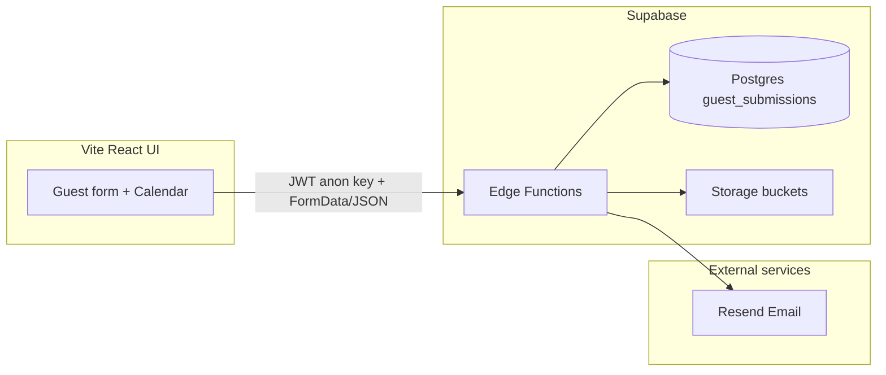

# Architecture overview

Part of the [`docs/PROJECT.md`](../PROJECT.md) architecture split — see that index for the full topic list.

---

## 1. Purpose and product context

The application supports **short-term rental guest onboarding** for a specific unit (**Monaco 2604**, **Kame Home** branding). Guests complete a **Guest Advice / Advise Form (GAF)**-style submission that includes:

- Identity and contact details
- Stay dates and guest counts
- Optional parking and pet information with uploads
- Required uploads: **downpayment receipt** (Facebook bookings); **valid government ID per guest aged 18+** (up to 5 guests; ages collected per guest; adults/children derived from ages ≤3 = child; fifth guest capped at age 3; Azure allows 4 adults + 1 child — UI shows Azure reminder when the 5th guest slot is added or when more than 4 adults)

Submissions are persisted in **Supabase Postgres**, files go to **Supabase Storage**, and optional automation sends **emails (Resend)** and runs the booking status workflow — all behind **Supabase Edge Functions** (Deno).

---

## 2. High-level architecture

- **UI**: React 18, Vite, React Router, React Hook Form + Zod, Tailwind, Radix/shadcn-style components, Sonner toasts (error and warning copy is sanitized to short host-facing lines).
- **Backend**: Supabase Edge Functions under `supabase/functions/` (no separate Node API package).
- **Local dev**: `dev.sh` runs **`scripts/dev/run-with-ui-dev-env.sh`** before **`supabase start`**, then **`scripts/dev/build-local-functions-env.sh`** + **`supabase functions serve`** so `GOOGLE_CLIENT_ID` / `GOOGLE_CLIENT_SECRET` from **`ui/.env.development`** are in the shell when the CLI resolves `config.toml` `env(...)`. Edge secrets come from a merged **`supabase/.temp/functions-serve.env`**. Then `cd ui && bun run dev`. **Package manager:** **Bun** (`bun install`, `bun run …`). **UI-only (no Docker):** `./dev.sh --ui-only` or `SKIP_SUPABASE=1 ./dev.sh` — point `ui/.env.development` at a hosted Supabase project. Do not start a second `supabase functions serve` in parallel (Docker edge-runtime name conflict). **`bun run dev:api`** uses the same merged env file.
- **502 on `/functions/v1/*` (Kong “Bad Gateway”)**: Usually Kong is still targeting an old **Docker edge-runtime** IP after **`bun run db:reset`** or a partial restart while `./dev.sh` is running. **`bun run stop:supabase`** then **`./dev.sh`** resyncs Kong with the host `functions serve` process. Confirm with `docker logs supabase_kong_<project> 2>&1 | tail -20` — look for `Host is unreachable` toward `172.x.x.x:8081`.
- **CLI env**: `config.toml` references `GOOGLE_CLIENT_*` from the process environment. Prefer **`bun run status:supabase`**, **`bun run stop:supabase`**, **`bun run db:reset`**, **`bun run start:supabase`**: they run **`bunx supabase@latest`** via `scripts/dev/run-with-ui-dev-env.sh`, which also loads `ui/.env.development`. A **global** `supabase` on PATH (e.g. v2.40.x) is easy to leave outdated and break Postgres 17 migrations (`storage.buckets` missing).
- **Nuclear local reset**: **`bun run stop:supabase:clean`** stops the stack and **deletes Docker data volumes** (fixes sticky Storage `migrations_name_key` issues when the CLI keeps **restoring from backup**). Then `bun run start:supabase`. All local DB data is lost until you `db reset` / migrations / optional prod sync.
- **Cloud Agent env (`.cursor/environment.json`)**: reproduces the full local stack (Docker → Supabase DB/Auth/Storage/edge + Vite UI) in a Cloud Agent VM on the **`develop`** branch. `install` (`.cursor/install.sh`) installs Bun + `docker.io` + `fuse-overlayfs`, runs `bun install`, generates git-ignored dev env files (`.cursor/write-env-files.sh`), warms Supabase images, and validates migrations. `start` (`.cursor/start.sh`) starts `dockerd` with nested-container fixes (`.cursor/docker-up.sh`) and runs `bun run start:supabase`. Terminals run the host edge-functions server (`.cursor/serve-functions.sh`, merged `supabase/.temp/functions-serve.env`) and the UI (`bun run dev`). Nested Docker needs three fixes each boot (not in snapshots): fuse-overlayfs storage driver, `net.bridge.bridge-nf-call-iptables=0`, and `iptables-legacy -P FORWARD ACCEPT`. Real Resend/Google/Telegram/Gmail secrets are optional — guest-form → Postgres/Storage works without them.
- **Cursor agents:** See **`.cursor/rules/README.md`** (rules, skills, subagents index).
- **Docker RAM (local Supabase):** Full stack needs Docker Desktop. To reduce memory: (1) **`./dev.sh --ui-only`** when only editing UI against a hosted project; (2) **`bun run stop:supabase`** when done for the day; (3) Docker Desktop → **Settings → Resources** — lower CPU/RAM if you only need the UI most of the time; (4) avoid leaving `./dev.sh` + ngrok + second IDE running when not testing webhooks. Supabase local typically uses **~2–4 GB** depending on images running.
- **CI:** GitHub Actions **`.github/workflows/ci.yml`** — `bun install`, `type-check`, `lint`, `build` on push/PR.

---

## 3. Repository layout

| Path                             | Role                                                           |
| -------------------------------- | -------------------------------------------------------------- |
| `ui/`                            | Vite SPA: guest form, calendar picker, success page            |
| `supabase/migrations/`           | Postgres schema, RLS, storage policies                         |
| `supabase/functions/`            | Deno edge functions + `_shared` modules                        |
| `supabase/config.toml`           | Local Supabase + function JWT settings                         |
| `scripts/`                       | Dev, deploy, data sync, integrations — see `scripts/README.md` |
| `docs/`                          | Doc index ([[README]]), guides, operations runbooks            |
| `dev.sh`                         | Local stack (Docker + Supabase + UI) or `--ui-only`            |
| `.cursor/rules/architecture.mdc` | Feature folders, shared utils, import conventions              |
| `.fallow/baseline.json`          | Fallow dead-code regression baseline (optional CI gate)        |

**Dev tooling** (root): `bun run lint`, `lint:fix`, `type-check`, `check:filenames`, `format`, `format:check`. **Husky** runs lint-staged on commit and **commitlint** on commit messages. ESLint + Prettier configs live at repo root (Prettier) and `ui/eslint.config.js`. **VS Code:** `.vscode/tasks.json` (dev, Supabase, quality, deploy), `.vscode/launch.json` (Chrome debug), `.vscode/settings.json` (Bun UI + Deno edge functions). See **`.cursor/rules/architecture.mdc`** for folder conventions; **[[project-structure|UI project structure]]** for `features/guest/` vs `features/dashboard/`. Backlog: **[`docs/README.md`](../README.md)** (GitHub Issues; shipped archive in `docs/archive/todos/shipped/`).

**UI entry**: `ui/src/main.tsx` → `App.tsx` → `routes/index.tsx` → merges `features/guest/routes`, `features/sd-form/routes`, `features/pay-parking/routes`, and `features/dashboard/routes`.

---

## 14. Known implementation notes

- **`compareFormData`** (server) compares many scalar fields and file re-uploads; **`petType` is not currently in the compared field list**, so changing only pet type might not trigger an update pipeline—extend the list in `_shared/utils.ts` if that becomes a product requirement.
- **Dashboard JWT** (`getSessionJwt` in `ui/src/features/dashboard/org/lib/edgeClient.ts`) reuses the cached access token and refreshes only when it is near expiry. Do not call `refreshSession()` on every edge request: hosted Auth rate-limits `/token` (`over_request_rate_limit`) and a 429 can sign the user out.

---

## 15. Key files quick reference

| Concern                                  | Location                                                                                                                                                                                                                                                                |
| ---------------------------------------- | ----------------------------------------------------------------------------------------------------------------------------------------------------------------------------------------------------------------------------------------------------------------------- |
| Submit pipeline                          | `supabase/functions/submit-form/index.ts`                                                                                                                                                                                                                               |
| DB + overlap + FormData processing       | `supabase/functions/_shared/databaseService.ts`                                                                                                                                                                                                                         |
| Field-level diff for updates             | `supabase/functions/_shared/utils.ts` (`compareFormData`)                                                                                                                                                                                                               |
| Form UI                                  | `ui/src/features/guest/form/components/GuestForm.tsx`                                                                                                                                                                                                                   |
| Validation schema                        | `ui/src/features/guest/form/schemas/guestFormSchema.ts`                                                                                                                                                                                                                 |
| Telegram marketing (Edge + Marketing UI) | [[telegram-marketing-reminders]], `supabase/functions/_shared/telegramMarketing.ts`, `supabase/functions/_shared/telegramMarketingCronSync.ts`, `supabase/migrations/20260615105000_telegram_marketing_cron_slots.sql`, `supabase/snippets/telegram-marketing-cron.sql` |
| AI payment receipt validation            | [[ai-payment-receipt-validation]], `supabase/functions/_shared/receiptValidationService.ts`, `supabase/migrations/20260717120000_receipt_ai_validation_columns.sql`, `supabase/migrations/20260718120000_parking_receipt_ai_validation.sql`                             |
| Calendar page                            | `ui/src/features/guest/calendar/pages/CalendarPage.tsx`                                                                                                                                                                                                                 |
| Date helpers / overlap helpers           | `ui/src/utils/format/dates.ts`                                                                                                                                                                                                                                          |
