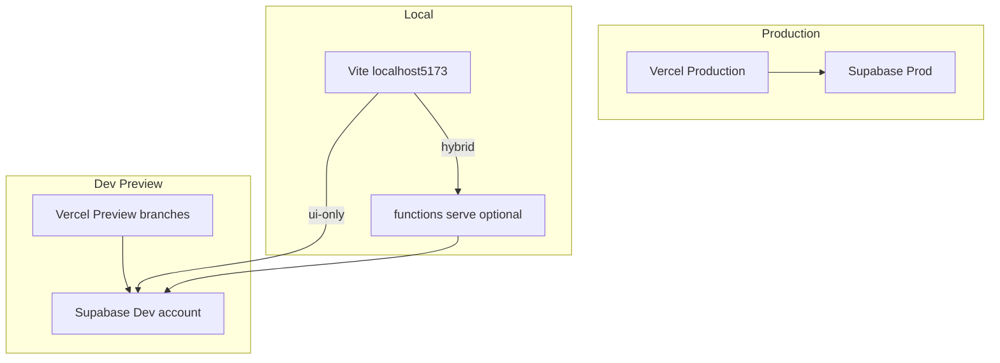

# Dev / staging environment — setup & daily workflows

Use this runbook to stand up a **separate dev Supabase project** (different account from production), wire **`kame-homes`** Vercel to it, and work locally **without the full Docker stack** when you only need UI or edge-function iteration.

### Dual-track (multi-tenant WIP)

| Track                         | Git branch                   | Vercel project                                                                               | Supabase ref                                                 |
| ----------------------------- | ---------------------------- | -------------------------------------------------------------------------------------------- | ------------------------------------------------------------ |
| **Live**                      | `main`                       | [`guest-form-management-app`](https://vercel.com/sprmkes-projects/guest-form-management-app) | **LEGACY** `zftt…`                                           |
| **Multi-tenant (dev now)**    | **`develop`**                | [`kame-homes`](https://vercel.com/kame-works/kame-homes) Preview                             | **MULTI_TENANT_DEV** `fwor…` — **`dev.kamehomes.space`**     |
| **Multi-tenant (prod later)** | **`main`** _(after release)_ | [`kame-homes`](https://vercel.com/kame-works/kame-homes) Production                          | **MULTI_TENANT_PROD** _(create)_ — **`app.kamehomes.space`** |

Do **not** point Production env vars at multi-tenant Supabase or push multi-tenant schema to LEGACY until cutover. Canonical ref table: [`deployment.md`](../../architecture/deployment.md). Design/plan: [`ci-cd-dev-prod-design.md`](../../workflow/in-progress/ci-cd-environments/ci-cd-dev-prod-design.md), [`ci-cd-dev-prod.md`](../../workflow/in-progress/ci-cd-environments/ci-cd-dev-prod.md).

| Doc                                                      | Role                                        |
| -------------------------------------------------------- | ------------------------------------------- |
| **This file**                                            | Dev/staging setup + local mode picker       |
| [`production-deployment.md`](./production-deployment.md) | Production cutover only (`kamewave` unlock) |
| [`migration-runbook.md`](./migration-runbook.md)         | Migration history repair, local Postgres    |

---

## 0. What you are building

Three tiers:

| Tier                    | UI                                                                                                    | Backend                        | When to use              |
| ----------------------- | ----------------------------------------------------------------------------------------------------- | ------------------------------ | ------------------------ |
| **Production (live)**   | [`guest-form-management-app`](https://vercel.com/sprmkes-projects/guest-form-management-app) — `main` | **LEGACY** Supabase            | Live users               |
| **Multi-tenant hosted** | [`kame-homes`](https://vercel.com/kame-works/kame-homes) — mt branch                                  | **MULTI_TENANT_DEV** Supabase  | Multi-tenant integration |
| **Dev / Preview**       | `kame-homes` Preview (PRs) or local Vite                                                              | Multi-tenant dev Supabase      | QA, demos                |
| **Local**               | Vite `:5173`                                                                                          | Local Docker **or** hosted dev | Day-to-day development   |



**Important:** Production Supabase deploys stay blocked until a human says unlock word **`kamewave`** in chat (`.cursor/rules/no-prod-deploy.mdc`). Dev deploys (`bun run deploy:supabase:dev`, `:dev:db`, `:dev:functions`) run **without** the kamewave prompt — the script's own DEV/PROD ref check plus a typed `dev` confirmation is the safety net, and it never touches prod.

---

## 1. Prerequisites

Before starting, confirm you have:

| Requirement               | Notes                                                                                    |
| ------------------------- | ---------------------------------------------------------------------------------------- |
| Supabase CLI              | `bunx supabase@latest` via repo scripts                                                  |
| Docker Desktop            | Required for **full local stack** and for `functions serve` (one edge-runtime container) |
| Bun                       | `bun install` at repo root                                                               |
| Vercel project            | Already connected; Production env points at **prod** Supabase                            |
| Separate Supabase account | New account/email for dev — keeps billing and access isolated from prod                  |
| Google Cloud project      | Dev OAuth clients + optional dev service account for Calendar/Sheets                     |
| Resend account            | Dev/test API key or same key with dev `EMAIL_TO`                                         |

---

## 2. Step-by-step — create the dev Supabase project

### Step 2.1 Create the project

1. Log into the **dev Supabase account** (not the prod account).
2. **New project** → pick a region close to prod (lower latency).
3. Choose **Postgres 17** if offered (matches [`supabase/config.toml`](../../../supabase/config.toml)).
4. Save a strong database password (Dashboard → Project Settings → Database).

Record these values (you will need them repeatedly):

| Name                     | Where to find                      | Example                                 |
| ------------------------ | ---------------------------------- | --------------------------------------- |
| `DEV_PROJECT_REF`        | Dashboard URL / Settings → General | `abcdefghijklmnop`                      |
| `DEV_SUPABASE_URL`       | Settings → API → Project URL       | `https://abcdefghijklmnop.supabase.co`  |
| Dev **anon** key         | Settings → API                     | `eyJhbGciOi...`                         |
| Dev **service_role** key | Settings → API                     | `eyJhbGciOi...` (secret — never commit) |

### Step 2.2 Link CLI to dev (temporary)

From repo root, logged into the **dev** Supabase account:

```bash
bunx supabase@latest login
bunx supabase@latest link --project-ref <DEV_PROJECT_REF>
```

Verify:

```bash
cat supabase/.temp/project-ref
# Must print your DEV ref — not prod
```

> **Guard:** Before any `db push` or `functions deploy`, always run `cat supabase/.temp/project-ref`. If it shows prod, stop and re-link dev.

### Step 2.3 Apply migrations

```bash
bun run deploy:supabase:dev -- --db-only
```

`deploy-supabase-dev.sh` passes **`db push --include-all` by default** (and `cd-dev.yml` does the same on every push to **`develop`**). That applies migrations whose timestamps are older than the remote head — common when parallel branches merge. Use `--no-include-all` only if you intentionally want strict ordering.

Or manually:

```bash
bunx supabase@latest db push --include-all
```

This applies every file in `supabase/migrations/` to the empty dev database.

**Verify in Dashboard → SQL Editor:**

```sql
SELECT count(*) FROM supabase_migrations.schema_migrations;
-- Should match the number of migration files in the repo

SELECT tablename FROM pg_tables WHERE schemaname = 'public' ORDER BY 1 LIMIT 20;
-- Should list guest_submissions, organizations, properties, etc.
```

### Step 2.4 Deploy edge functions

```bash
bun run deploy:supabase:dev -- --functions-only
```

Or:

```bash
bunx supabase@latest functions deploy
```

Check Dashboard → Edge Functions — all functions from `supabase/functions/` should appear.

### Step 2.5 Configure Edge Function secrets

Dashboard → **Project Settings → Edge Functions → Secrets**.

Copy names from [`supabase/.env.example`](../../../supabase/.env.example). Minimum dev set:

| Secret                   | Dev value guidance                                                |
| ------------------------ | ----------------------------------------------------------------- |
| `ENVIRONMENT`            | `development` — softens calendar/sheet labels                     |
| `ADMIN_ALLOWED_EMAILS`   | Comma-separated team emails allowed on `/bookings`                |
| `RESEND_API_KEY`         | Dev/test Resend key                                               |
| `EMAIL_TO`               | Your personal or team dev inbox                                   |
| `EMAIL_REPLY_TO`         | Same or another dev inbox                                         |
| `GOOGLE_SERVICE_ACCOUNT` | Single-line JSON — **dev** SA with access to dev calendar + sheet |
| `GOOGLE_CALENDAR_ID`     | Dev calendar ID                                                   |
| `GOOGLE_SPREADSHEET_ID`  | Dev spreadsheet ID                                                |

**Defer until needed:** Gmail listener secrets, Telegram, Meta inbox, AI keys, cron secrets.

Hosted Supabase injects `SUPABASE_URL` and `SUPABASE_SERVICE_ROLE_KEY` automatically — do not duplicate unless overriding.

### Step 2.6 Configure Auth (Google sign-in)

Hosted projects **ignore** `[auth.external.google]` in `config.toml`. Configure in Dashboard:

1. **Authentication → Providers → Google** — enable; paste OAuth Web client **id + secret** (see Step 2.7).
2. **Authentication → URL Configuration:**
   - **Site URL:** `http://localhost:5173` (add preview URL later)
   - **Additional Redirect URLs:**
     - `http://127.0.0.1:5173`
     - `https://<DEV_REF>.supabase.co/auth/v1/callback` (usually auto)
     - Each Vercel preview origin you use (added after first preview deploy)

### Step 2.7 Google Cloud — OAuth client for dev Auth

In Google Cloud Console (same or separate GCP project):

1. **APIs & Services → Credentials → Create OAuth 2.0 Client ID → Web application**.
2. **Authorized JavaScript origins:**
   - `http://localhost:5173`
   - `http://127.0.0.1:5173`
   - Your Vercel preview URL(s) when known
3. **Authorized redirect URIs:**
   - `https://<DEV_REF>.supabase.co/auth/v1/callback`
4. Paste **Client ID** and **Client secret** into Supabase Dashboard → Auth → Google provider.

For **local full-stack** (`./dev.sh`), `GOOGLE_CLIENT_ID` / `GOOGLE_CLIENT_SECRET` in `ui/.env.development` still power **local** GoTrue — separate from hosted dev Auth.

### Step 2.8 Google Cloud — service account (Calendar + Sheets)

1. Create or reuse a GCP service account.
2. Enable **Google Calendar API** and **Google Sheets API**.
3. Download JSON key → compress to **single-line** string for `GOOGLE_SERVICE_ACCOUNT` secret.
4. Share dev calendar and dev spreadsheet with the SA `client_email` (Editor).

### Step 2.9 Fresh seed data (no prod copy)

Dev uses a **fresh empty DB** after migrations — no prod data sync.

1. Deploy Vercel Preview or run local UI against dev (Section 4).
2. Open `/onboarding` and create a test organization + property.
3. Configure **Property → Settings** (payment, GAF, email routing, document requirements).
4. Add yourself to `ADMIN_ALLOWED_EMAILS` (must match the Google account you sign in with).

Optional smoke SQL after onboarding:

```sql
SELECT id, slug FROM organizations LIMIT 5;
SELECT id, slug, organization_id FROM properties LIMIT 5;
```

### Step 2.10 Re-link production CLI (if this machine deploys prod)

After dev bootstrap, restore prod link **only if** you deploy prod from this machine:

```bash
bunx supabase@latest link --project-ref <PROD_PROJECT_REF>
cat supabase/.temp/project-ref   # must show prod ref again
```

Skip this if this laptop never runs prod deploys.

---

## 3. Step-by-step — wire **`kame-homes`** to dev Supabase

### Step 3.1 Add **Production** environment variables on `kame-homes`

Open [`kame-homes`](https://vercel.com/kame-works/kame-homes) → **Settings → Environment Variables**.

Add for **Production** (this project's Production = multi-tenant integration app):

| Variable                 | Production value on `kame-homes`                        |
| ------------------------ | ------------------------------------------------------- |
| `VITE_NODE_ENV`          | `development`                                           |
| `VITE_SUPABASE_URL`      | `https://fworvijbrwpyngycotbz.supabase.co/functions/v1` |
| `VITE_API_URL`           | Same as `VITE_SUPABASE_URL`                             |
| `VITE_SUPABASE_ANON_KEY` | Dev anon key                                            |

**Do not** change **Production** env on [`guest-form-management-app`](https://vercel.com/sprmkes-projects/guest-form-management-app) — that stays LEGACY.

Optional: duplicate the same four vars on **`kame-homes` Preview** for PRs.

### Step 3.2 Deploy the multi-tenant branch

```bash
git push -u origin feature/support-multi-users-and-properties   # or develop
```

Vercel → **`kame-homes`** → open the **Production** deployment URL.

### Step 3.3 Register preview URL in Supabase Auth + Google

Copy the **`kame-homes`** production origin after deploy (e.g. `https://kame-homes.vercel.app`).

Add to:

- Supabase → Auth → **Additional Redirect URLs**
- Google OAuth client → **Authorized JavaScript origins**

Redeploy preview if env vars were added after the first build.

### Step 3.4 Smoke test preview

- [ ] Guest form loads and submits (network tab shows **dev** `*.supabase.co` ref)
- [ ] Admin sign-in at `/for-hosts/login` works for allow-listed email
- [ ] `/bookings` lists submissions
- [ ] Production site still hits **prod** ref (spot-check separately)

---

## 4. Step-by-step — local env files

### Step 4.1 Create dev backend secrets file

```bash
cp supabase/.env.dev.example supabase/.env.dev.local
```

Edit `supabase/.env.dev.local`:

```bash
DEV_PROJECT_REF=your-dev-ref
DEV_SUPABASE_URL=https://your-dev-ref.supabase.co
DEV_SERVICE_ROLE_KEY=your-dev-service-role-key

# Edge secrets for local functions serve against dev (copy from Dashboard or supabase/.env.example)
ENVIRONMENT=development
ADMIN_ALLOWED_EMAILS=you@example.com
RESEND_API_KEY=re_...
EMAIL_TO=dev-inbox@example.com
EMAIL_REPLY_TO=dev-inbox@example.com
# GOOGLE_SERVICE_ACCOUNT='{"type":"service_account",...}'
# GOOGLE_CALENDAR_ID=...
# GOOGLE_SPREADSHEET_ID=...
```

Never commit `supabase/.env.dev.local`.

### Step 4.2 Create hosted-dev UI env file

**UI-only mode** (no local edge functions):

```bash
cp ui/.env.development.dev.example ui/.env.development.dev
```

Edit for **ui-only** (uncomment the ui-only block):

```bash
VITE_NODE_ENV=development
VITE_SUPABASE_URL=https://<DEV_REF>.supabase.co/functions/v1
VITE_API_URL=https://<DEV_REF>.supabase.co/functions/v1
VITE_SUPABASE_ANON_KEY=<dev-anon-key>
```

**Hybrid mode** (local edge functions → dev DB/auth/storage):

Use the **hybrid** block in the same file:

```bash
VITE_SUPABASE_URL=http://127.0.0.1:54321/functions/v1
VITE_API_URL=http://127.0.0.1:54321/functions/v1
VITE_SUPABASE_PROJECT_URL=https://<DEV_REF>.supabase.co
VITE_SUPABASE_ANON_KEY=<dev-anon-key>
```

`VITE_SUPABASE_PROJECT_URL` sends Auth / Storage / Realtime to hosted dev while API calls hit local `functions serve`.

### Step 4.3 Optional — explicit local-stack UI env

Only needed for `./dev.sh --ui-only --env local` (UI against local Supabase without full dev.sh):

```bash
cp ui/.env.development.local.example ui/.env.development.local
```

Point all URLs at `http://127.0.0.1:54321`. Requires `bun run start:supabase` running separately.

### Step 4.4 Keep existing `ui/.env.development`

Do **not** delete your current `ui/.env.development`. Full-stack `./dev.sh` still uses it for Google OAuth + Vite. Many developers keep local URLs there and use `.env.development.dev` only for hosted-dev modes.

---

## 5. Local development modes

### Mode A — Full local stack (default, unchanged)

**When:** Migrations, RLS, local Postgres, Meta webhooks with ngrok, full integration.

```bash
./dev.sh
# or: npm run dev
# or VS Code: Run Task → "Start dev server"
```

Starts: Docker Postgres/Auth/Storage + local edge functions + ngrok + Vite.

Requires: Docker Desktop, `ui/.env.development` with local URLs + `GOOGLE_CLIENT_*`.

### Mode B — Hosted dev, UI only (no Docker stack)

**When:** UI work, testing against dev DB already deployed.

```bash
./dev.sh --ui-only --env dev
# or VS Code: Run Task → "Dev: Hosted dev (UI only)"
```

Requires: `ui/.env.development.dev`, dev Supabase bootstrapped (Section 2).

### Mode C — Hosted dev, hybrid (local edge functions)

**When:** Editing edge function TypeScript without `functions deploy` to dev.

**Terminal 1:**

```bash
bun run dev:remote-api
# or VS Code: Run Task → "Dev: Edge functions (dev stack)"
```

**Terminal 2:**

```bash
./dev.sh --ui-only --env dev
```

Use **hybrid** URLs in `ui/.env.development.dev` (Section 4.2).

**Note:** `functions serve` still uses **one** Docker edge-runtime container — not the full Supabase stack.

### Mode D — Deploy backend changes to dev

**When:** New migrations or ready to publish edge functions to hosted dev.

```bash
bun run deploy:supabase:dev
# db only:  bun run deploy:supabase:dev -- --db-only
# fns only: bun run deploy:supabase:dev -- --functions-only
```

Script prompts you to type `dev` and refuses if `DEV_PROJECT_REF` equals `PROD_PROJECT_REF` in `.env.dev.local`.

After deploy, test with Mode B or Vercel Preview.

### Migration limitation (read this)

You **cannot** test new SQL migrations on hosted Postgres without applying them. Options:

| Approach      | Command                                         |
| ------------- | ----------------------------------------------- |
| Apply to dev  | `bun run deploy:supabase:dev -- --db-only`      |
| Apply locally | `bun run start:supabase` + `bun run db:migrate` |

Hybrid mode covers **edge function code**, not unapplied migration DDL.

---

## 6. VS Code / Cursor run tasks

| Task                                      | What it runs                                                |
| ----------------------------------------- | ----------------------------------------------------------- |
| **Start dev server** _(default)_          | `./dev.sh` — full local stack                               |
| **Dev: Local Supabase (full stack)**      | `./dev.sh` — alias                                          |
| **Dev: UI only (remote Supabase)**        | `./dev.sh --ui-only` — legacy; uses `ui/.env.development`   |
| **Dev: Hosted dev (UI only)**             | `./dev.sh --ui-only --env dev`                              |
| **Dev: Edge functions (local stack)**     | `bun run dev:api`                                           |
| **Dev: Edge functions (dev stack)**       | `bun run dev:remote-api`                                    |
| **Dev: Hosted dev (hybrid — API + UI)**   | Parallel: remote-api + hosted UI                            |
| **Deploy: Supabase dev**                  | `bun run deploy:supabase:dev`                               |
| **Deploy: Supabase dev (db only)**        | `bun run deploy:supabase:dev:db`                            |
| **Deploy: Supabase dev (functions only)** | `bun run deploy:supabase:dev:functions`                     |
| **Backup: Supabase dev / prod**           | `bun run backup:supabase:dev` / `:prod`                     |
| **Rollback: Supabase dev / PROD**         | `bun run rollback:supabase:dev` / `:prod` (prod = kamewave) |
| **Env: Status**                           | `bun run env:status`                                        |
| **Migrations: Status (dev / prod)**       | `bun run migrations:status:dev` / `:prod`                   |

**Debug compounds:** Run and Debug → **Start dev server + Chrome**, **Dev: Hosted dev + Chrome**, **Dev: Hosted dev (hybrid) + Chrome**.

---

## 7. Which Supabase project am I linked to?

```bash
cat supabase/.temp/project-ref
```

| Ref matches | Safe to run                                                      |
| ----------- | ---------------------------------------------------------------- |
| Dev ref     | `deploy:supabase:dev`, dev Dashboard work                        |
| Prod ref    | Read-only (`db diff --linked`); prod deploy only with `kamewave` |

Or the scripted version: `bun run env:status` (prints ref + `dev`/`prod`/`unknown` classification).

---

## 8. Troubleshooting

| Symptom                                                     | Fix                                                                                                                                                                                                                                                                                                                                                              |
| ----------------------------------------------------------- | ---------------------------------------------------------------------------------------------------------------------------------------------------------------------------------------------------------------------------------------------------------------------------------------------------------------------------------------------------------------- |
| `./dev.sh --ui-only --env dev` → missing env file           | Create `ui/.env.development.dev` from example                                                                                                                                                                                                                                                                                                                    |
| `dev:remote-api` → missing `.env.dev.local`                 | Create `supabase/.env.dev.local` from example                                                                                                                                                                                                                                                                                                                    |
| Admin sign-in fails on preview                              | Add preview URL to Supabase Auth + Google OAuth origins                                                                                                                                                                                                                                                                                                          |
| Form hits wrong Supabase ref                                | Check `VITE_SUPABASE_URL` in active env file / Vercel Preview vars                                                                                                                                                                                                                                                                                               |
| `deploy:supabase:dev` refuses                               | `DEV_PROJECT_REF` equals prod — fix `.env.dev.local`                                                                                                                                                                                                                                                                                                             |
| `Unauthorized` on deploy but `projects list` works          | Stale `SUPABASE_ACCESS_TOKEN` in `supabase/.env.dev.local` overrides `supabase login` — remove that line; local deploy script ignores it. Or export a fresh PAT in the shell only.                                                                                                                                                                               |
| 502 on local `/functions/v1` after reset                    | `bun run stop:supabase` then `./dev.sh`                                                                                                                                                                                                                                                                                                                          |
| Hybrid auth works but API 503                               | Start `dev:remote-api` first; check hybrid env URLs                                                                                                                                                                                                                                                                                                              |
| `gen_random_bytes does not exist` on dev `db push`          | `20260908115900` enables `pgcrypto` in schema `extensions`; RBAC migrations use `extensions.gen_random_bytes()`. If push failed mid-way, run Dashboard SQL then re-push: `CREATE EXTENSION IF NOT EXISTS pgcrypto WITH SCHEMA extensions;` and `ALTER DATABASE postgres SET search_path TO public, extensions;` then `bun run deploy:supabase:dev -- --db-only`. |
| `cd-dev.yml` fails: migrations to insert before remote head | Fixed in repo: dev deploy uses `db push --include-all` by default. Re-run workflow or `bun run deploy:supabase:dev`. Manual strict push: `bun run deploy:supabase:dev -- --db-only --no-include-all`.                                                                                                                                                            |
| Edge functions 404 on dev site but UI loads                 | Check GitHub Actions **CD Dev** — if red, backend did not deploy. `cd-dev.yml` runs migrations + all functions on push to **`develop`**.                                                                                                                                                                                                                         |
| `permission denied for sequence org_settings_id_seq`        | Apply `20261008120000_service_role_sequence_grants.sql` via `bun run deploy:supabase:dev -- --db-only`. Immediate: Dashboard SQL `GRANT USAGE, SELECT ON SEQUENCE public.org_settings_id_seq TO service_role;`                                                                                                                                                   |
| OAuth `invalid_client` locally                              | Verify `GOOGLE_CLIENT_*` in `ui/.env.development`; restart Supabase                                                                                                                                                                                                                                                                                              |

---

## 9. Quick reference commands

```bash
# Full local stack (default)
./dev.sh

# Hosted dev UI only
./dev.sh --ui-only --env dev

# Local functions → dev database
bun run dev:remote-api

# Deploy to dev Supabase
bun run deploy:supabase:dev

# Back up dev / prod (also runs automatically before deploy — skip with --skip-backup)
bun run backup:supabase:dev
bun run backup:supabase:prod

# Roll back to most recent backup
bun run rollback:supabase:dev
bun run rollback:supabase:prod   # requires kamewave

# Check who's applied what migrations where (read-only)
bun run migrations:status:dev
bun run migrations:status:prod

# Check linked project
cat supabase/.temp/project-ref
```

---

## 10. Related files

| File                                                                                              | Purpose                                |
| ------------------------------------------------------------------------------------------------- | -------------------------------------- |
| [`supabase/.env.dev.example`](../../../supabase/.env.dev.example)                                 | Dev project ref + secrets template     |
| [`ui/.env.development.dev.example`](../../../ui/.env.development.dev.example)                     | Hosted dev UI env                      |
| [`ui/.env.development.local.example`](../../../ui/.env.development.local.example)                 | Local stack UI env                     |
| [`scripts/deploy/deploy-supabase-dev.sh`](../../../scripts/deploy/deploy-supabase-dev.sh)         | Dev deploy with prod guard             |
| [`scripts/deploy/backup-supabase.sh`](../../../scripts/deploy/backup-supabase.sh)                 | Pre-deploy backups (dev + prod)        |
| [`scripts/deploy/rollback-supabase.sh`](../../../scripts/deploy/rollback-supabase.sh)             | DB restore from backup                 |
| [`scripts/deploy/rollback-functions.sh`](../../../scripts/deploy/rollback-functions.sh)           | Edge Functions rollback (git worktree) |
| [`scripts/deploy/migration-status.sh`](../../../scripts/deploy/migration-status.sh)               | Read-only migration drift check        |
| [`scripts/dev/check-linked-project.sh`](../../../scripts/dev/check-linked-project.sh)             | Linked-project preflight + audit log   |
| [`scripts/dev/run-remote-functions-serve.sh`](../../../scripts/dev/run-remote-functions-serve.sh) | Hybrid local API                       |
| [`.vscode/tasks.json`](../../../.vscode/tasks.json)                                               | Run Task entries                       |

---

## 11. Backups & rollback

Every `deploy:supabase*` run backs up first (`backup-supabase.sh`) unless `--skip-backup` is passed — schema and data dumps land in `backups/<env>/<UTC-timestamp>_{schema,data}.sql` (gitignored). Every deploy and rollback also appends a row to `backups/deploy-log.csv` (timestamp, env, kind, git SHA/branch, OS user) — a lightweight audit trail of who deployed what, when.

```bash
# Manual backup
bun run backup:supabase:dev
bun run backup:supabase:prod

# Restore the most recent backup (add --schema to also restore structure)
bun run rollback:supabase:dev
bun run rollback:supabase:prod       # requires kamewave + typed "prod" confirm

# Roll back Edge Functions to an older commit (no local checkout needed)
bun run rollback:functions:dev -- main
bun run rollback:functions:prod -- main   # requires kamewave
```

Both rollback scripts refuse to run if the currently linked project doesn't match the `<dev|prod>` argument, and both support `--dry-run` to preview the exact restore command without executing it. `rollback-supabase.sh` needs a Postgres connection string — `DEV_DB_URL` / `PROD_DB_URL` — supplied at runtime (same convention as `PROD_DB_URL` in `scripts/data/sync-prod-public-data-to-local.sh`); it is never committed.

See [`production-deployment.md`](./production-deployment.md) §1 and §12 for the prod-specific checklist, and [`migration-runbook.md`](./migration-runbook.md) §6 for restore caveats.

Before mt-prod cutover, run the measured hosted-dev restore rehearsal in [`hosted-dev-rollback-rehearsal.md`](./hosted-dev-rollback-rehearsal.md) (preflight: `bun run rehearsal:rollback:dev:preflight`).
