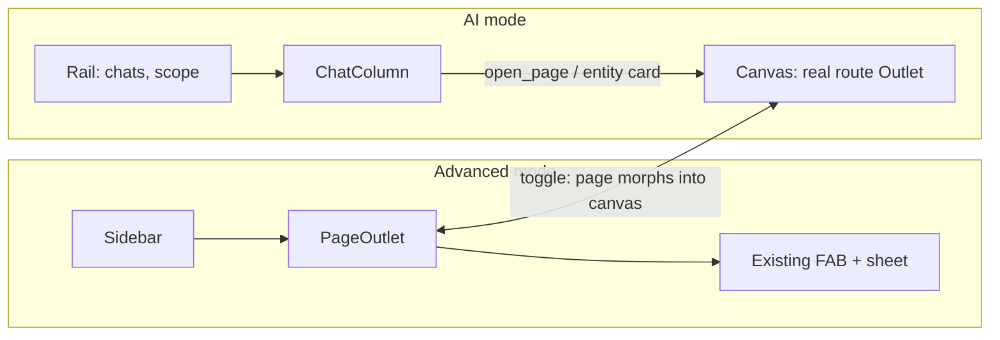
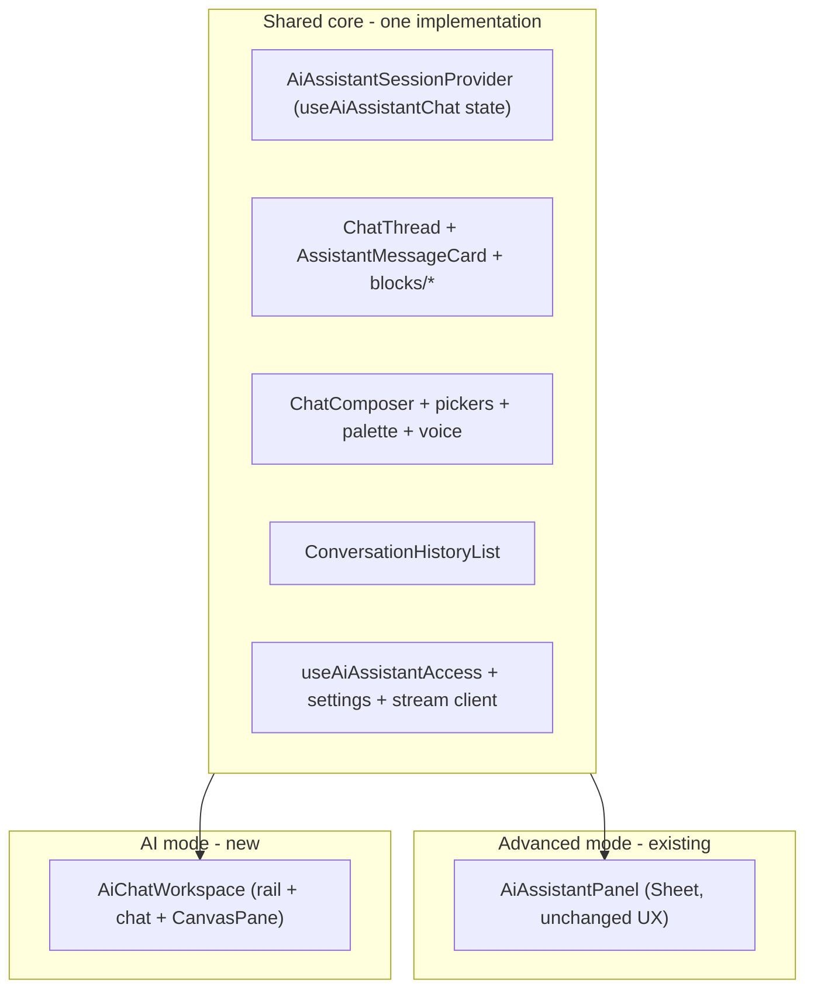

# AI chat mode vs Advanced mode

## Goal

Hosts can switch the dashboard between two modes:

- **Advanced:** today's app, with the existing bottom-right AI assistant sheet unchanged.
- **AI:** a new chat-first, full-page workspace. The real app pages open as a live canvas beside the chat.

The switch animates smoothly between modes and keeps the conversation. The end goal is **parity**: anything a host can do in Advanced mode, across org, property, and parking, is either an assistant tool or a one-tap **Open** handoff to the exact screen.

## Decisions (confirmed by host, 2026-09-27)

| Decision    | Choice                                                                                                                                                 |
| ----------- | ------------------------------------------------------------------------------------------------------------------------------------------------------ |
| Layout      | Chat-first workspace with a rail. Real routes render in a canvas pane beside the chat, and **Open in Advanced** grows the canvas into the full page    |
| Persistence | Server-side per user (`user_ui_preferences`), cached in localStorage for instant first paint                                                           |
| Parity      | "Never build" actions stay out of the tool catalog. The AI hands off with an **Open** block that loads the exact screen in the canvas                  |
| Containers  | The existing sheet (`AiAssistantPanel`) is **kept as-is**. The full page is a **new** container (`AiChatWorkspace`). Both are built on one shared core |

## Scope

**In:**

- The mode toggle and preference.
- The new full-page workspace, canvas, briefing home, and motion.
- The shared session provider.
- Modern chat UX: conversation management, edit and resend, copy, feedback, `open_page`, and live entity cards.
- Agent architecture: tool registry, routing, adaptive loop, memory, evals.
- Capability parity waves and a parity manifest test.

**Out:**

- Removing or redesigning the sheet assistant.
- Scheduled automations. Phase 8 needs its own plan.
- Super-admin surfaces.
- Anything on the never-build list in `docs/architecture/ai-dashboard-assistant.md` §5.

## 1. Where we are today (audit summary)

**Strengths.** These are already at the level of modern AI apps and should be kept:

- 100 tools: 52 read and 48 write (`supabase/functions/_shared/dashboardAssistantTools.ts` `TOOL_DECLARATIONS` plus sibling `dashboardAssistant*Tools.ts`).
- Tier 0/1/2 risk model with `external_send`, JWT RBAC re-check per tool, grounding guard, audit trail, and the kill switch plus plan gate (`aiDashboardAssistant`).
- SSE turn progress, cancel and regenerate, task plans, confirm cards, `dynamic_form`, canvas overlay, attachments, speech-to-text, context pins, and a Cmd+K palette.

**Architecture gaps:**

- **Sheet-coupled UI:** `AiAssistantPanel.tsx` (429 lines) is a Radix `Sheet` mounted beside the `Outlet` in `AdminLayout.tsx` (1123 lines). Chat state lives in `useAiAssistantChat`'s `useState`, so remounting the chat elsewhere would lose the thread.
- **Parking scope bug:** `PageContext` in `ui/src/features/dashboard/ai-assistant/lib/aiAssistantApi.ts` is `{ propertyId?, bookingId? }`, and the panel never sends `parkingId`, even though `dashboard-assistant-chat` supports it.
- **No tool routing:** all ~100 declarations go to Gemini 2.5 Flash on every round (`dashboard-assistant-chat/index.ts`, `tools: TOOL_DECLARATIONS`).
- **Short agent loop:** `MAX_TOOL_ROUNDS = 4`, with no plan-then-execute path and no background tasks.
- **Simulated streaming:** text is chunked about every 18ms after synthesis. This is intentional, because the grounding guard fails closed.
- **Conversations:** capped at the 20 most recent, with no search, rename, pin, delete, or pagination.
- **No memory or instructions:** there are no per-user or per-org standing preferences.
- **Not proactive:** the assistant is reactive only. There is no briefing or "needs attention" home.
- **No parity enforcement in code:** `.cursor/rules/ai-assistant-parity.mdc` exists, but nothing machine-checks it.

**Capability gaps** (dashboard vs. tools):

- **Bookings:** create booking (guide-only today), edit details or reschedule (`update-booking-details`, excluded), guest link tokens (`issue-guest-stay-guide-token`, `issue-guest-form-completion-token`, `issue-booking-document-share-token`), and the `booking-ai-review` trigger.
- **Parking:** team tools (`parking-team-*`), non-payment `parking-settings`, parking date block/unblock, and parking-scoped finance.
- **Org:** portfolio analytics, activity log read (`list-activity-log`), and create property or parking listing.
- **Pricing:** smart pricing preview and apply (`smart-pricing-preview` / `smart-pricing-apply`). Bulk range edits are already planned in [`ai-assistant-bulk-pricing-chat.md`](./ai-assistant-bulk-pricing-chat.md).
- **Settings:** payment methods, email automations, and doc requirements ([`ai-assistant-settings-validators.md`](./ai-assistant-settings-validators.md)), plus voice receptionist settings.
- **Inbox:** quick-reply template CRUD, and Meta connect (OAuth, so this is a handoff).
- **Team:** custom role CRUD at all scopes.
- **Help:** ticket reply and reopen.
- **Notifications:** mark read.
- **Handoff-only by design:** OAuth, OTP completion, checkout, canvas editors (Marketing, Page editor), CSV import commit, delete org/property, and `auto_reply_mode = send`.

## 2. Research: patterns worth adopting

- **ChatGPT / Claude:** a left rail for history and projects, a canvas or artifacts pane, edit and resend, copy, feedback, visible memory controls, and scheduled tasks.
- **Shopify Sidekick** (the closest analog). An admin AI that navigates to the right admin screen, previews changes, and needs approval for writes. This maps onto our Tier 2 plus canvas handoff.
- **Notion AI / Copilot:** the assistant is ambient in the same workspace. The page and the chat share context, and switching keeps you in place.
- **Hostaway / Guesty AI:** inbox drafting plus an operational attention list.
- **Generative UI:** live, actionable components (entity cards that refresh, tables with row actions, diff previews) instead of static text.

Run the `competitive-ux-research` skill at the start of implementation and record the findings here.

## 3. Target experience

- **URL is the source of truth for scope** (`/org/:orgSlug[/property|parking/:slug]/...`). The conversation lives in `?chat=<conversationId>`. Refreshing, sharing a link, and Back all work in both modes.
- **Advanced to AI:** the current page shrinks into the canvas, the chat column slides in, and the sidebar collapses into the rail. The same conversation continues with `pageContext` set to that page.
- **AI to Advanced:** the canvas expands to the full page. The chat stays reachable through the existing FAB and sheet, with the same thread and draft.
- **Toggle:** a segmented control (`Advanced` | `AI`) in the desktop sidebar header, the mobile top bar, and the user menu, plus a shortcut (Cmd/Ctrl+J).
- **Gating:**
  - The toggle is hidden when the kill switch or `ai_mode_enabled` is off.
  - When plan-blocked, the toggle shows a lock and opens the upgrade modal.
  - Super-admin is excluded.

### 3a. Alignment contract: sheet and full page

- **The bottom-right assistant stays.** In Advanced mode, the FAB (desktop) and the Assistant tab (mobile) keep opening the existing sheet. It is not removed or redesigned.
- **One flow, two surfaces.** Every chat flow or UX improvement lands in the shared core, so both surfaces behave the same.
  - **Identical behavior:** send, stream, cancel, regenerate, confirm cards, dynamic forms, pins, attachments, voice, history, quick actions, `open_page`, edit and resend, feedback, and gating.
  - **Per-surface layout:** width, rail vs. history toggle, canvas placement (`ChatCanvasOverlay` in the sheet, `CanvasPane` on the full page), composer size, and briefing density.
- **Definition of done** for any assistant UI change: it works in both surfaces, the surface-parity Vitest test passes, and the manual guide's two-surface checklist is ticked.
- **Continuity:** switching modes keeps the thread, draft, pins, and any in-flight stream, because the session provider owns that state.

### 3b. Full-page AI chat: UI/UX spec

**Direction:** "calm operator."

- Follow DESIGN.md: Plus Jakarta Sans, teal `--primary`, `--radius` 0.75rem, light theme, and token classes only (`text-admin-page-title`, `text-card-title`, `text-caption`).
- No gradients, glow, or purple "AI" styling.
- The brand shows in the details: the teal focus ring, a teal streaming caret, and confirm cards tinted with the status color.

**Desktop (1024px and up):** a grid `[rail 264px | chat minmax(0,1fr) | canvas 0 or clamp(420px,46vw,760px)]`.

- **Rail** (collapsible to 64px icons):
  - The scope switcher (reusing the tenant switcher), then **New chat** (Cmd/Ctrl+Shift+O).
  - Search (Cmd/Ctrl+K palette).
  - Pinned chats and recent chats grouped by Today, Yesterday, and Earlier. The row overflow opens `ResponsiveOverflowMenu` (rename, pin, archive).
  - At the bottom: the mode toggle, usage, and the user.
- **Chat column:**
  - Max width 760px, centered, 24px gutters.
  - User bubbles right-aligned on the muted surface.
  - Assistant turns are unboxed full-width `AssistantMessageCard`s, with a hover row: copy, regenerate, thumbs up/down.
  - A sticky composer docked 16px from the bottom. It autosizes from 1 to 8 lines, with chips above and a toolbar (pins, paperclip, mic, send/stop).
- **Canvas pane:**
  - A card surface with a 12px radius, inset 8px.
  - The header holds the route title, **Open in Advanced**, and close.
  - The body is the real `<Outlet />` with its own scroll.
  - It is resizable with an 8px gutter, and the width is saved to localStorage (420px to 60vw).

**Tablet (768-1023px):** the rail is an overlay drawer. The canvas takes over the chat area with Back.

**Phone (375px):**

- **Top bar:** the scope pill (opens `MobileChoiceSheet`), the mode toggle, and history (opens a bottom sheet).
- **Composer:** a `ContextualActionBar`-style dock, the **only** bottom layer. `BottomTabBar` is hidden in AI mode.
- **Canvas:** a full-screen push with Back.
- **Touch targets:** at least 44px.

**Briefing home (empty thread):**

- A greeting in `text-admin-page-title`, with no subtitle.
- Up to 6 attention cards (2 columns, 1 on phone). Each card has a status icon, a count in `text-stat-value`, a short label, and a chevron. Tapping one sends its prompt.
- 4 starter chips.
- The composer autofocuses on desktop only.
- A layout-matched skeleton while loading.

**States (hardening):**

- **Loading:** layout-matched skeletons with the chrome mounted.
- **Streaming:** `AssistantTurnProgress`, then a preview with a teal caret. `aria-live="polite"` announces the final text only.
- **Error or interrupted:** an inline card with a one-line reason and **Retry**. It keeps the existing single auto-retry.
- **Offline:** a `You're offline` banner, with Send disabled and the draft kept.
- **Plan-blocked:** preview-open layout, and submit opens the upgrade modal.
- **Kill switch or `ai_mode_enabled` off:** the toggle is hidden, and a saved `ai` falls back to `advanced` silently.
- **No permission:** a normal refusal turn with **Open** to a page the host can see.
- **Long content:** tables over 8 rows open in the canvas, `break-words` on IDs, and truncated names get a title tooltip.
- **Draft safety:** the draft is kept per conversation in sessionStorage.
- **Double submit:** Send is disabled while a request is in flight. Confirm keeps the atomic claim.
- **Keyboard:**
  - Enter sends and Shift+Enter adds a newline.
  - Up arrow in an empty composer edits the last message.
  - Esc stops streaming, then closes the canvas.
  - Cmd/Ctrl+J toggles the mode.
  - Focus goes to the composer on entering AI mode and to `main` on entering Advanced.
- **Overflow:** `tabular-nums` on counts and money, and no fixed-width text boxes.

**Motion tokens** (shared by both surfaces, in `ui/src/features/dashboard/ai-assistant/lib/assistantMotion.ts`):

- `spring.mode`: stiffness 380, damping 36, mass 0.9 (the mode switch and canvas open).
- `spring.soft`: stiffness 260, damping 30 (the rail collapse and composer lift).
- Micro-interactions: 160ms ease-out on enter and 110ms ease-in on exit.
- Message entrance: 8px rise plus fade, with a 30ms stagger and at most 4 staggered items.
- Only transform, opacity, and clip-path are animated. Animations are interruptible.
- Reduced motion collapses everything to a 150ms opacity crossfade.

**Copy** (human-copy rules, no em dashes):

- `Advanced`, `AI`, `New chat`, `Open`, `Open in Advanced`, `Retry`, `You're offline`.
- No subtitles or helper paragraphs.

## 4. Implementation tasks

### Phase 0: Foundations

- [ ] Add `parkingId` to `PageContext` (`ai-assistant/lib/aiAssistantApi.ts`) and send it from `AiAssistantPanel.tsx` via `useParkingIdParam()`, with a unit test.

### Phase 1: Two containers, one shared core

- [ ] Add `AiAssistantSessionProvider` in `AdminLayout` that owns the `useAiAssistantChat` state. `AiAssistantPanel` reads from it, with no visual or behavioral change.
- [ ] Build the new `AiChatWorkspace` in `ui/src/features/dashboard/ai-assistant/components/full-page/`. It reuses `ChatThread`, `AssistantMessageCard`, `blocks/*`, `ChatComposer`, `ConversationHistoryList`, and the hooks.
- [ ] Add an `assistantSurface` prop (`'sheet' | 'full'`) that affects density and width only, plus a Vitest test that renders the same messages in both surfaces.
- [ ] Eager-load the full-page chunk when the saved mode is `ai`. The sheet stays lazy.

### Phase 2: Mode infrastructure

- [ ] Migration: a `user_ui_preferences` table (`user_id` PK referencing `auth.users`, `dashboard_mode` check `advanced|ai`, `updated_at`) with own-row RLS.
- [ ] Edge function `user-ui-preferences` (GET/PATCH, JWT, validator).
- [ ] `useDashboardMode()`: localStorage cache `kame-admin-ui-mode:<userId>`, server reconcile, and a `?mode=ai` override.
- [ ] Add an `ai_mode_enabled` column on `ai_dashboard_assistant_global_settings`, with a toggle on the Super Admin kill-switch card.
- [ ] Toggle in the sidebar header, mobile top bar, and user menu, with the Cmd/Ctrl+J shortcut and gating.
- [ ] Record decisions:
  - Plans: reuse `aiDashboardAssistant`.
  - Team RBAC: N/A (UI preference; tools re-check permissions).
  - Activity log: N/A (per-user UI preference).

### Phase 3: AI mode shell

- [ ] `AdminLayoutShell` branches on the mode: `advanced` keeps today's layout, FAB, and sheet; `ai` renders `AiModeShell` (rail, chat, and a `CanvasPane` rendering `<Outlet />`), with the FAB and sheet hidden.
- [ ] Canvas state is URL-driven. Closing it navigates to the scope root.
- [ ] Mobile: one bottom layer, bottom sheets for pickers, and `bottomTabBarOffsetClassName()`.
- [ ] Skeleton: extend `ui/src/components/skeletons/AiAssistantSkeleton.tsx`.
- [ ] Page titles: `usePageTitle` with `${Org|Property} - Assistant`.

### Phase 4: Transition

- [ ] Framer-motion `LayoutGroup` with `layoutId="dashboard-main"` so the page FLIPs into the canvas. The chat enters with `AnimatePresence`, and the sidebar morphs into the rail with transform/clip-path.
- [ ] Performance guard: `layout="position"` on heavy children and a `data-transitioning` freeze. Disable `PageTransition` during the switch.
- [ ] Progressive `document.startViewTransition` with the framer fallback, plus the reduced-motion crossfade.
- [ ] Mobile: the page scales to 0.94 and slides back as the chat rises.

### Phase 5: Modern chat UX (shared core, both surfaces)

- [ ] Conversations: pagination, search, rename, pin, archive/delete (PATCH/DELETE on `dashboard-assistant-conversations`, plus a migration for `pinned`/`archived_at`).
- [ ] Messages: edit and resend, copy, feedback (`dashboard_assistant_feedback` table, surfaced on `SuperAdminAiUsagePage`), and stop and edit.
- [ ] `dashboard-assistant-briefing` read-only edge function (deterministic, no LLM call) plus briefing cards.
- [ ] Route allowlist registry (`_shared/dashboardAssistantRoutes.ts` plus a UI mirror), an `open_page` tool and block, and live `entityRef` blocks via TanStack Query.
- [ ] Composer slash commands and @-mentions (reusing the pickers). `aria-live` and focus management.
- [ ] Decide on real token streaming for Tier-0 answers with post-hoc guard retraction, and record the decision here.

### Phase 6: Agent architecture

- [ ] `defineAssistantTool({ name, module, scopes, permission, planFeature?, tier, uiLabel, declaration })` registry as the single source for classifier sets, labels, and docs.
- [ ] Two-stage tool router: a scope, permission, and plan filter, then an intent module picker. Target 15-30 tools per call.
- [ ] Adaptive rounds (up to 8, within the context budget) plus a plan-then-execute path. Bulk writes stay a single Tier 2 batch confirm.
- [ ] Per-user instructions and org house style, plus a `remember_preference` Tier-1 tool with an editable memory list.
- [ ] Model routing (Flash-Lite for routing and titles, Flash by default, optional Pro).
- [ ] A golden eval set per module and scope, reported on super-admin AI usage.

### Phase 7: Capability parity

- [ ] Parity manifest `_shared/dashboardAssistantParity.ts` (every host write edge function maps to `tool | handoff(routeKey) | excluded(reason)`), with a Deno drift test.
- [ ] Wave A: parking team, settings, blocks, and finance; org analytics; `list_activity_log`.
- [ ] Wave B: create booking; update details or reschedule (shared validator, reviewed against `booking-workflow.mdc`); guest link tokens; booking AI review.
- [ ] Wave C: smart pricing preview and apply with diff, plus the bulk pricing plan.
- [ ] Wave D: the settings validators plan, voice receptionist, quick-reply CRUD, and custom roles.
- [ ] Wave E: guided create property/parking, ticket reply and reopen, notifications mark read, and handoff entries for every excluded action.
- [ ] Every new tool: decide Plans and RBAC, add `logActivity` (or N/A), follow the tier rules, and update the catalog doc and manual guide.

### Phase 8 (later, separate plan): proactive automations

Scheduled prompts, chat-delivered alerts, and long-running tasks (pg_cron plus a queue, quotas, audit).

## 5. Testing

- **Vitest:** the mode hook, the route allowlist mirror, `pageContext` with `parkingId`, `open_page` and entity-ref blocks, and surface parity.
- **Deno:** the tool router filter, registry-to-classifier drift, the parity manifest, and the `user-ui-preferences` / `dashboard-assistant-briefing` handlers.
- **Playwright `@ci`:**
  - Toggle Advanced to AI and back on booking detail (route and thread preserved).
  - Persistence after reload.
  - Canvas open/close.
  - 375px with a single bottom layer.
  - The plan-locked toggle.
  - Plus a `@smoke` toggle case.
- **Manual:** a motion QA checklist (60/120Hz, reduced motion, Safari View Transitions fallback) and a two-surface checklist in `docs/guides/testing/ai-dashboard-assistant-manual.md`.

## 6. Docs to update (in the same changes)

- `docs/architecture/ai-dashboard-assistant.md`: an AI mode section, the tool registry, router, `open_page`, the parity manifest, and new tools per wave.
- `docs/architecture/overview.md` and `docs/PROJECT.md`: new edge functions, tables, and the `?mode` / `?chat` params.
- A new route guide `docs/guides/routes/org/assistant.md` (with Host-facing knowledge) plus Testing rows, then `bun run sync:ai-knowledge-base`.
- `docs/architecture/plans-feature-matrix.md`: AI mode reuses `aiDashboardAssistant`.
- `.cursor/rules/ai-assistant-parity.mdc`: point to the parity manifest test.

## Open questions

None. All three design decisions are confirmed above.
